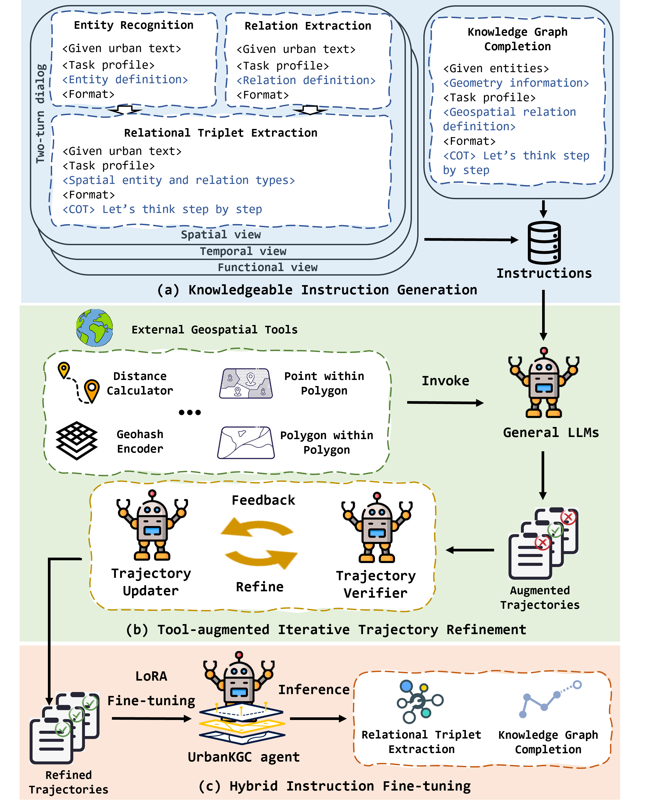

# UrbanKGent: A Unified Large Language Model Agent Framework for Urban Knowledge Graph Construction

<p align="center">


</p>

<p align="center">

| **[1 Introduction](#introduction)** 
| **[2 Requirements](#requirements)**
| **[3 Usage](#usage)**
| **[4 Citation](#citation)**
| **[Website](https://htmlpreview.github.io/?https://raw.githubusercontent.com/usail-hkust/UrbanKGent/main/UrbanKGent%20Demo/index.html)** |

</p>

<a id="introduction"></a>
## 1 Introduction

Official code for article "[UrbanKGent: A Unified Large Language Model Agent Framework for Urban Knowledge Graph Construction](https://arxiv.org/pdf/2402.06861.pdf)".

Urban knowledge graph has recently worked as an emerging building block to distill critical knowledge from multi-sourced urban data for diverse urban application scenarios. Despite its promising benefits, urban knowledge graph construction (UrbanKGC) still heavily relies on manual effort, hindering its potential advancement. This paper presents UrbanKGent, a unified large language model agent framework, for urban knowledge graph construction.



### Try our UrbanKGC Agent Service Here:
https://htmlpreview.github.io/?https://raw.githubusercontent.com/usail-hkust/UrbanKGent/main/UrbanKGent%20Demo/index.html


<a id="requirements"></a>
## 2 Requirements

`python=3.8`,`torch=2.1.1`, `transformers=4.35.2`, `accelerate=0.25.0`, `geographiclib=2.0`, `request=2.31.0`,  `geopy=2.4.1`, `geohash2=1.1`

<a id="usage"></a>

## 3 Usage

- To run OpenAI LLM agent, you need to set your key in `mian_TE/KGC.py`:

```
python main_KGC/TE.py
```

To run the Llama-2 LLM agent, we first open the Llama-2 inferrence local-host api: 

```
python utils/open_llm_api.py
```
And then,
```
python main_KGC/TE.py
```

## 4 Citation

```
@article{ning2024urbankgent,
  title={UrbanKGent: A Unified Large Language Model Agent Framework for Urban Knowledge Graph Construction},
  author={Ning, Yansong and Liu, Hao},
  journal={arXiv preprint arXiv:2402.06861},
  year={2024}
}
```
